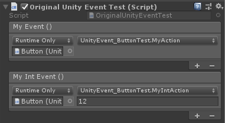

# Task, Delegate, Event, and Func (Action)

Unity使ってて何となく苦手だなー、わからんなーと思っていたことをまとめてお勉強。

それぞれ参考にしたウェブ記事等は、それぞれのコードの先頭に URL 等を記載している。

## UnityEvent, UnityAction も追加

これをエディタからいじれるのが便利ポイント。

スクリプトからイベントを登録する場合も追加。